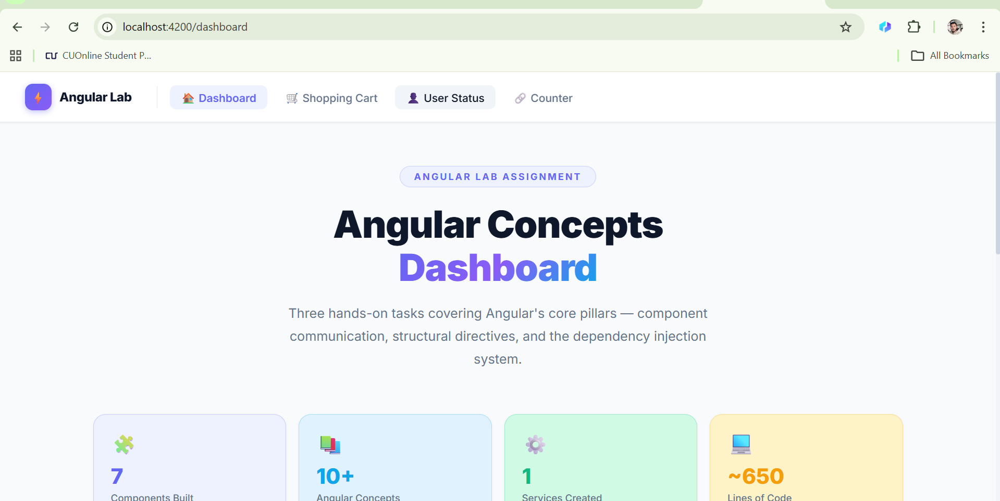
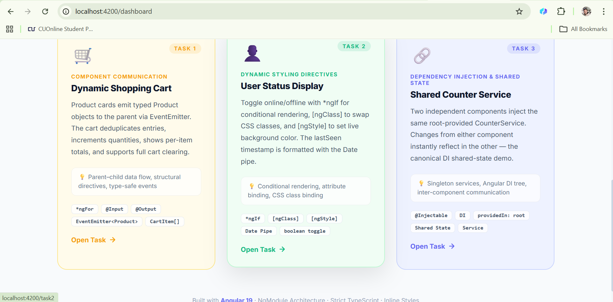
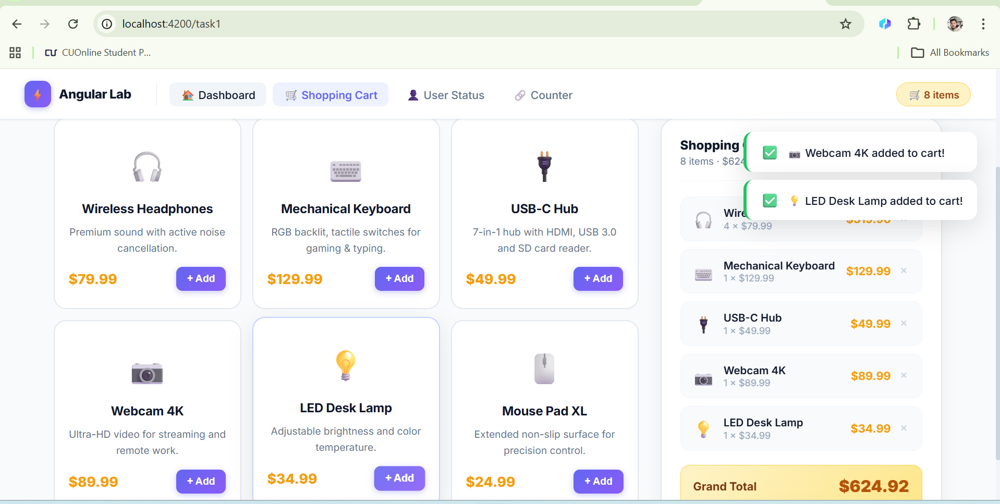
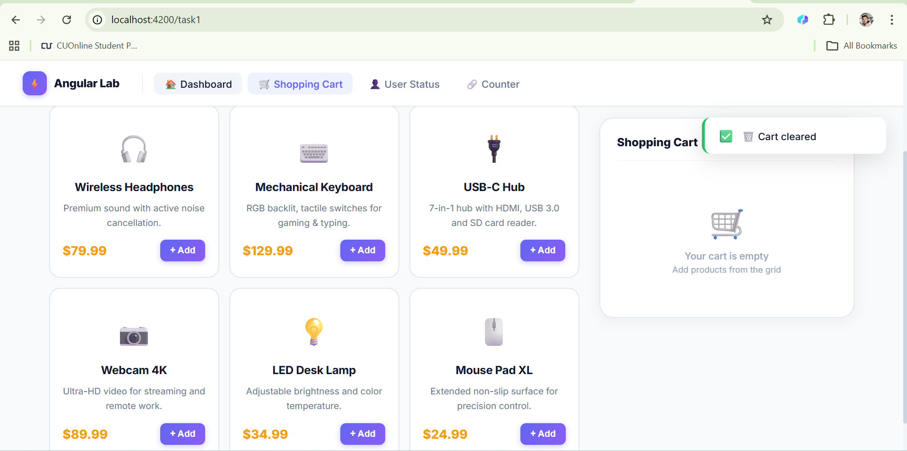
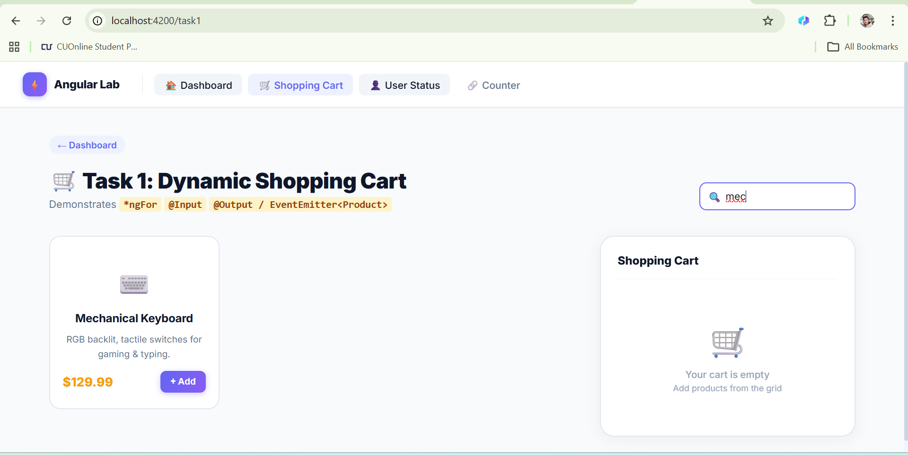
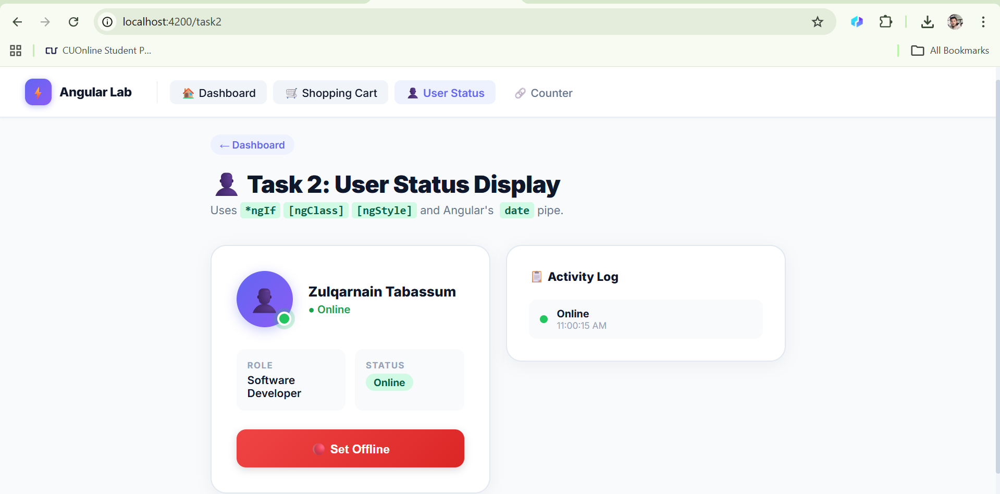
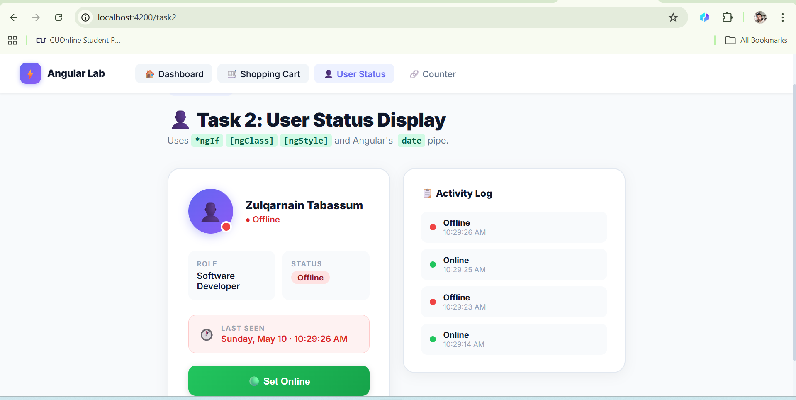
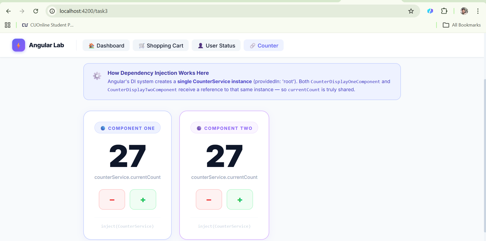

# Angular Lab Assignment — Documentation

> **Framework:** Angular 19 (NgModule Architecture)
> **TypeScript:** Strict mode  
> **Styling:** Angular inline styles (no external CSS frameworks)

---
## 📸 Screenshots

> Add your screenshots inside the `screenshots/` folder and they will appear here automatically.

<div align="center">

### 🏠 Dashboard

| Dashboard |
|:---:||:---:|
|  | |

---

### 🛒 Task 1 — Shopping Cart

| Empty Cart | Cart with Items |
|:---:|:---:|:---:|
|  |  | |

---

### 🟢 Task 2 — User Status

| Online | Offline |
|:---:|:---:|
|  |  |

---

### 🔢 Task 3 — Shared Counter

| Initial State | Shared State Demo |
|:---:|
|  |

</div>

## 🚀 How to Run

```bash
cd angular-lab
npm install
ng serve        # → http://localhost:4200
```

---

## 📁 Project Structure

```
src/app/
├── app.module.ts                   ← Root NgModule (declares all 9 components)
├── app.ts                          ← Root component (nav, toasts, cart badge)
├── app.html / app.css              ← App shell: sticky navbar + router-outlet
├── app.routes.ts                   ← Eager-loaded routes for all 3 tasks
│
├── dashboard/                      ← Dashboard page (links to all tasks)
├── product-card/                   ← Task 1 child component (@Input/@Output)
├── task1-shopping-cart/            ← Task 1 page (cart logic)
├── user-status/                    ← Task 2 component (*ngIf/[ngClass]/[ngStyle])
├── task2-user-status/              ← Task 2 page wrapper
├── counter.ts                      ← Task 3: CounterService (providedIn: 'root')
├── counter-display-one/            ← Task 3 Component One
├── counter-display-two/            ← Task 3 Component Two
└── task3-counter/                  ← Task 3 page wrapper
```

---

## 🏠 Dashboard

Landing page with navigation links to all three tasks.

**Extra features:** stats row, concept callout cards, hover animations.

---

## NgModule Architecture

All components are declared in a single root `AppModule`. There are no standalone components — every component uses `standalone: false`.

### `app.module.ts`

```typescript
@NgModule({
  declarations: [
    App,
    DashboardComponent,
    Task1ShoppingCartComponent,
    ProductCardComponent,
    Task2UserStatusComponent,
    UserStatusComponent,
    Task3CounterComponent,
    CounterDisplayOneComponent,
    CounterDisplayTwoComponent,
  ],
  imports: [
    BrowserModule,
    FormsModule,
    RouterModule.forRoot(routes),
  ],
  providers: [],
  bootstrap: [App],
})
export class AppModule {}
```

### `main.ts`

```typescript
import { platformBrowserDynamic } from '@angular/platform-browser-dynamic';
import { AppModule } from './app/app.module';

platformBrowserDynamic()
  .bootstrapModule(AppModule)
  .catch((err: unknown) => console.error(err));
```

### `app.routes.ts` (Eager Loading)

```typescript
export const routes: Routes = [
  { path: '',        redirectTo: 'dashboard', pathMatch: 'full' },
  { path: 'dashboard', component: DashboardComponent },
  { path: 'task1',   component: Task1ShoppingCartComponent },
  { path: 'task2',   component: Task2UserStatusComponent },
  { path: 'task3',   component: Task3CounterComponent },
];
```

---

## Task 1 — Dynamic Shopping Cart

### Angular Concepts

| Concept | Where Used |
|---|---|
| `*ngFor` | Iterating `products[]` and `cartItems[]` |
| `@Input({ required: true })` | `ProductCardComponent` receives typed `Product` |
| `@Output() addedToCart = new EventEmitter<Product>()` | Card emits full `Product` to parent |
| Component communication | Parent `onProductAddedToCart(product: Product)` handles event |

### Interfaces

```typescript
export interface Product {
  name: string;
  price: number;
  description: string;
  emoji: string;
}

interface CartItem {
  name: string;
  quantity: number;
  price: number;
  emoji: string;
}
```

### Core Logic

```typescript
onProductAddedToCart(product: Product): void {
  const existing = this.cartItems.find(i => i.name === product.name);
  if (existing) {
    existing.quantity++;
  } else {
    this.cartItems.push({ ...product, quantity: 1 });
  }
}

clearCart(): void { this.cartItems = []; }
```

### Extra Features
- **Live product search** via `[(ngModel)]`
- **Remove single item** button per cart row
- **Toast notifications** on add/clear using Angular `signal()`
- **Cart badge** in navbar tracking total item count

---

## Task 2 — User Status Display

### Angular Concepts

| Directive | Usage |
|---|---|
| `*ngIf` | "Last Seen" block only shows when `isOnline === false` |
| `[ngClass]` | Applies `.online-status` / `.offline-status` to indicator dot |
| `[ngClass]` (badge) | Applies `.online-badge` / `.offline-badge` to status badge |
| `[ngStyle]` | Sets `background-color` of the dot dynamically |
| `[ngStyle]` (button) | Changes button gradient based on `isOnline` |
| `date` pipe | Formats `lastSeen: Date` → `'EEEE, MMM d · h:mm:ss a'` |

### Component Properties

```typescript
export class UserStatusComponent {
  isOnline: boolean = true;
  statusMessage: string = 'Online';
  lastSeen: Date = new Date();
  history: StatusHistoryEntry[] = [];
}
```

### CSS Classes (`user-status.css`)

```css
.online-status  { animation: pulse-green 1.5s infinite; }
.offline-status { animation: none; }
.online-badge   { background: #d1fae5; color: #065f46; }
.offline-badge  { background: #fee2e2; color: #991b1b; }
```

### Extra Features
- **Activity Log panel** — every toggle recorded with timestamp using `*ngFor`

---

## Task 3 — Shared Counter Service

### Angular Concepts

| Concept | Detail |
|---|---|
| `@Injectable({ providedIn: 'root' })` | Singleton across entire app |
| Constructor injection | `constructor(public counterService: CounterService)` |
| Shared state | Both components share the **same** instance |

### Service (`counter.ts`)

```typescript
@Injectable({ providedIn: 'root' })
export class CounterService {
  currentCount: number = 0;
  increment(): void { this.currentCount++; }
  decrement(): void { this.currentCount--; }
}
```

### Each Component

```typescript
export class CounterDisplayOneComponent {
  constructor(public counterService: CounterService) {}
}
// CounterDisplayTwoComponent is identical — same DI injection
```

### Extra Features
- DI explanation banner explaining Angular's singleton pattern
- Monospace `inject(CounterService)` label on each card

---

## Extra Features Summary

| Feature | Task | Angular API |
|---|---|---|
| Toast notifications | Task 1 | `signal<ToastMessage[]>()` |
| Navbar cart badge | Global | `signal<number>()` |
| Live product search | Task 1 | `[(ngModel)]`, getter filter |
| Remove individual item | Task 1 | `Array.filter()` |
| Activity log | Task 2 | `history[]`, `*ngFor`, `[ngStyle]` |
| DI explanation banner | Task 3 | — pedagogical callout |
| Stats row | Dashboard | `*ngFor`, `[style.color]` |
| Eager-loaded routes | Global | `RouterModule.forRoot(routes)` |

---

## Technologies

- **Angular 19** — NgModule architecture, traditional `*ngFor`/`*ngIf` directives
- **TypeScript** strict — typed interfaces, `EventEmitter<T>`
- **Angular Router** — `RouterLink`, `RouterLinkActive`, eager routes
- **Angular Signals** — `signal()` for toast/cart global state
- **CommonModule** — `*ngFor`, `*ngIf`, `[ngClass]`, `[ngStyle]`, `DatePipe`
- **FormsModule** — `[(ngModel)]` for search box
- **Google Fonts** — Inter typeface

---

